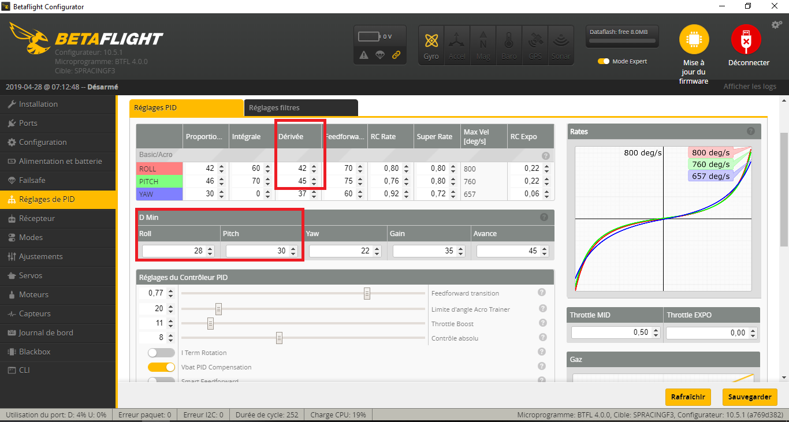

# D\_MIN

D\_Min可以在正常飞行过程中衰减D的有效值。对于可能会使系统产生过冲的快速翻滚和快速打杆行为，它可以将D衰减到正常范围内。它也会在穿越机发生洗桨时提高D的有效值（以对抗洗桨）。D的高值通常只是您的D的系数。D的低值则由`d_min_xxx`控制，此参数可以在CLI或者OSD的CMS菜单中调整。

在CLI中，D\_Min的相关设置项位于proflie列表的底部。

在OSD中，他们位于CMS菜单的MSIC页面下。

对比之前的版本来说，开启D\_Min将允许更高的D，甚至在某些情况下允许更高的P。而不是始终维持一个较高的D。

### **背景和目的**

在正常飞行中，拥有一个低于正常量的D具有以下优点：

* 受噪声影响小，这将导致电机变得更凉
* 全油门下有更干净的电机轨迹
* 提高飞机的瞬态响应能力
* D导致的震荡和其他折磨人的情况将不太可能再发生

但是，低D也有缺点：

* 更剧烈的洗桨
* 更大幅度的超调和反弹
* 当P项变高时，由于缺乏阻尼，导致快速打杆时带来P项震荡

D\_Min的目的是获得两方面的最佳效果：平稳飞行和低速转弯时的低D；需要抑制过冲时和需要应对洗桨时的高D。

### **我的穿越机已经飞的很好了，D\_Min会提升我的穿越机性能吗？**

可能会吧。

如果四轴飞的很好并且没有过冲、洗桨震颤或者电机过热的问题，那么启用d\_min可能没什么好处。

但是，通过启用D\_Min，您可以将P略微提升一点，并将峰值D提升一些——这可能会得到更加激进的控制效果。

### **如何禁用D\_Min？**

对于给定的轴，当d\_min= 0 或d\_min大于D时，则会在该轴上禁用D\_Min。这样，D的大小将始终保持不变。

### **我想尝试D\_Min，应该做哪些初始设置？**

当您导入PID时，原有的正常D值（即D的高值）将保留，d\_min值将会是Roll 20，Pitch 22，YAW 0。

对于启用D\_Min后的首次飞行，我建议将正常D值增加约10-20%，并将d\_min设置为D值的一半左右。

### **默认的D\_Min值是多少？**

默认值仅供参考，并不适合所有四轴。

Roll/Pitch上的D为35/38，d\_min为20/22。

### **启用D\_Min会完全抑制住洗桨震颤吗？**

不会。D\_Min是一种降低平时的D值的功能，较低的D值则通常意味着较弱的洗桨掌控力。

D\_Min算法通过对D进行备份来检测洗桨情况的发生并对其作出响应。但它的响应并没有我们想要的那么强烈。通常，D仅上升到预设D值的一半左右。为了充分利用D\_Min，将D值提高15-20%是非常重要的。通常，飞控对于洗桨的处理情况将与旧版本（D\_Cut）大致相同。

如果洗桨严重影响到了您的正常飞行，成为了您的主要问题，而且电机温度较低的话，请提高d\_min值。

### **我有严重的洗桨情况，禁用D\_Min会有所帮助**

根据@spatzengr（YouTube博主UAVTech）的建议，您可以同时提高D\_Min的值和普通D值。

下面是一个例子：

 

### **启用D\_Min会改善过冲吗？**

**会的。**即使是正常的D值不变， D\_Min在时间上的滞后增强效应也会改善过冲。

当D\_Min启用时，可以增加D的大小而仍使电机保持低温。通过增加D，为飞控改善过冲控制提供了更多的回旋余地。

D值应该适当调整，直到过冲情况得到了最有效的抑制，同时调整d\_min以对电机温度进行控制。

### **“d\_min\_advance”参数是用来干嘛的？**

D\_min\_advance加速了增强效果的开始。如果你在反应非常灵敏的四轴飞行器上进行超高频率翻滚，（换句话说，你的Rate全都很高而且你也很享受那种极速翻滚的感觉）这可能会有所帮助。

Advance参数的工作原理是：将一个由setpoint驱动的增强信号囊括进增强算法中。

当d\_min\_advance为0时，直到移动摇杆使飞机姿态改变后的某个时间点上，D将开始增大。这样将允许FF和P在“更早”地使飞机开始转弯，并且不受D的任何抑制效应，从而最大化地提高转弯的瞬态响应性。但是，对于一些响应非常灵敏的四轴来说（电机响应速度较高），若增强信号由陀螺仪信号来驱动的话，则有可能过于滞后。通过增加d\_min\_advance参数，飞控将在移动摇杆时就增大D，而不是等到姿态开始改变时再增大。

d\_min\_advance的范围是0-200。除非你打杆速度超级快，否则的话默认值20偏少。将此值设为100则将会得到显著的性能提升。除了那些最大角速度超过1000deg/s（高Rate）的四轴之外，此值不应再高于100。

### **那么“d\_min\_gain”参数呢？**

这是一个高级调参参数，用于确定在快速打杆期间的D的放大强度。

默认值20适用于绝大多数穿越机。对于非常干净（噪声水平很低）的四轴来说，将此值设为25相当合适。如果再把它设置的更高的话，那么四轴将不会在大部分时间内令D以最小值运行，并且D将会很容易地就爬升到最大值。如果你主要考虑的因素是要抑制洗桨，那样的话你确实可以把这个值设置得更高，但如果你想要一个低水平的D来控制电机温度的话，这样做的效果并不理想。

如果四轴可以录制黑盒日志的话，在正常飞行中理想的增益值应该是使debug2和debug3中的实际D值始终有增大的趋势（不是精准的维持在最小值上，而是有时会稍稍高于最小值），在快速翻滚中迅速上升到最大D值，在抑制洗桨时D值上升到中位值附近。

### **我如何才能知道在飞行中我得到的D的有效值是多少？**

1. 使用OSD：CLI中输入`set debug_mode = D_MIN`，并将OSD设置为在屏幕上显示debug2。您看到的数字将是D的10倍。例如：OSD显示数值为350，那么此时D的有效值为35。
2. 使用黑盒日志：CLI中输入`set debug_mode = D_MIN`。黑盒日志查看器中的debug2将显示Roll上的瞬时D值，debug3将显示Pitch上的瞬时D值。您看到的数字将是D的10倍。

### **D\_Min是如何工作的？**

洗桨的特点是：陀螺仪信号在20-60hz范围内震荡。

快速翻滚与10-30hz频率范围内的大幅运动相关联。

通过将一个80hz的双二阶低通滤波器应用于陀螺仪信号，飞控便可以检测到这些事件的发生，并且忽略高频噪声对于事件辨识的影响。快速翻滚和洗桨都将增大此增强信号。

通过使用一个10hz的一阶低通滤波器来平滑上述信号的绝对值，便提供了一种能够在这些事件发生时平滑轻柔改变D值的方法。10hz低通滤波器的作用是产生相位延迟，用于延迟D\_Min的D值增大效果。因此，D将在快速翻滚结束时增大，而不是在开始时就增大。这就意味着D\_Min的D值增大效应并不会抑制飞机对于摇杆命令输入的快速响应。

增强强度由增益来调整。

### **D\_Min会增加CPU负载吗？**

会，但不会增加很多。仅有一个Biquad滤波器和一个PT1滤波器，以及一些简单的数学运算。要详细了解D\_Min占用了多少的CPU负载，请先暂时将所有轴上的d\_min设置为0并重新在CLI中检查CPU的负载情况。

### **D\_Min是否适用于所有F3飞控？** 

并不适合。有些F3芯片没有足够的闪存空间用于存放D\_Min。以这些芯片为主控的飞控将不会在CLI或者OSD中显示d\_min相关选项。您可以通过自行编译固件，来构建包含D\_Min功能的F3固件，但是需要删除其他功能以腾出空间。

另请参阅：

* [ctzsnooze的D\_Cut原始PR](https://github.com/betaflight/betaflight/pull/7373)
* [将D\_Cut调整为D\_Min 的PR](https://github.com/betaflight/betaflight/pull/7538)
* [D\_Min与CMS菜单更改](https://github.com/betaflight/betaflight/pull/7559)

